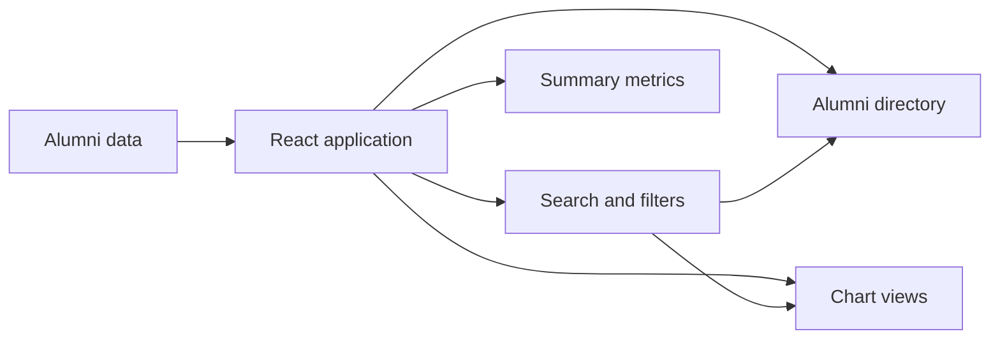

# SVES Alumni Dashboard

A web dashboard for exploring alumni information through searchable records, visual summaries, and operational views.

## What it demonstrates

SVES is a React application that combines structured alumni data with dashboard components, charts, and responsive interface patterns. It is a suitable example of a data-focused front end with a clear separation between source data, application state, and presentation.

## Architecture



The application loads structured alumni data, derives filtered views from user input, and presents those views through directory and chart components.

## Local development

```bash
npm ci
npm run dev
```

Validate a change before opening a pull request:

```bash
npm run lint
npm run build
```

## Project standards

Contributor guidance documents review expectations, while GitHub Actions validates the build and lint checks for pushes and pull requests.
